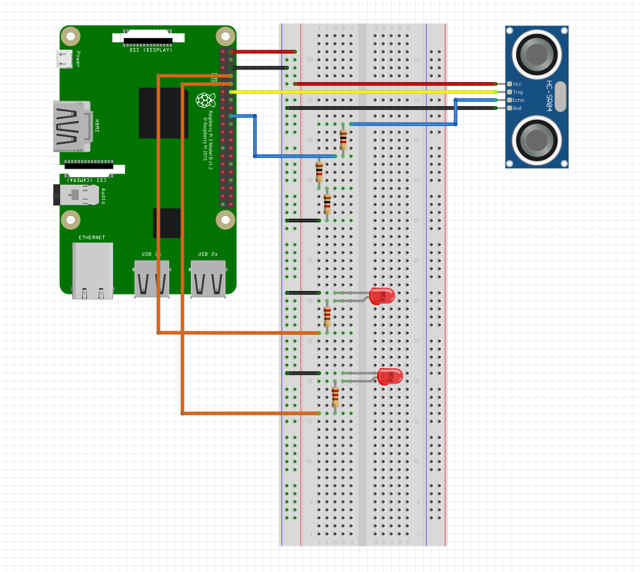

# SpaceApps-Drone-Control

An intuitive app developed to control Unmanned Arial vehicles (UAVs), along with proximity object detection. Winner (Singapore), NASA SpaceApps challenge, 2019.

The challenge we tackled is [here](https://2019.spaceappschallenge.org/challenges/planets-near-and-far/out-world/details).

## Developed alongside `SpaceApps-Drone-Inject`, located [here](https://github.com/RohanGautam/SpaceApps-Drone-Inject).

# Working demo:

# Schematic for both Code injectin and UAV control (present in `rPiFiles/schematic`)

> Communication is done via websockets between the flutter application(client) and the RPi(server), so make sure you change HOST (both in `flutterDistanceCommunicate.py` and `clientWebSocket.dart`) to your particular private IP address, and ensure both the Pi and the flutter mobile app are connected to the same network.

> ⚠ Make sure to disconnect the resistor to ground from the distance sensor before trying the injection example with the LED's, as the resistor connected to ground might pull down the voltage and LED's may not light up at all.

# References:
* [Websockets vs HTTP requests](https://blog.feathersjs.com/http-vs-websockets-a-performance-comparison-da2533f13a77)
* [Socket programming with dart](http://jamesslocum.com/post/67566023889)
* [Socket programming with python](https://realpython.com/python-sockets/#echo-client-and-server)
* [Using Flame, and building a joystick to control a plane in flutter](https://medium.com/@gilesjeremydev/create-a-virtual-joystick-for-flame-game-cf62cad7bc4)
* [PixlrX](https://pixlr.com/x/) for image editing (it's great)
* [Connecting the HC-SR04 distance sensor](https://thepihut.com/blogs/raspberry-pi-tutorials/hc-sr04-ultrasonic-range-sensor-on-the-raspberry-pi) to the pi
